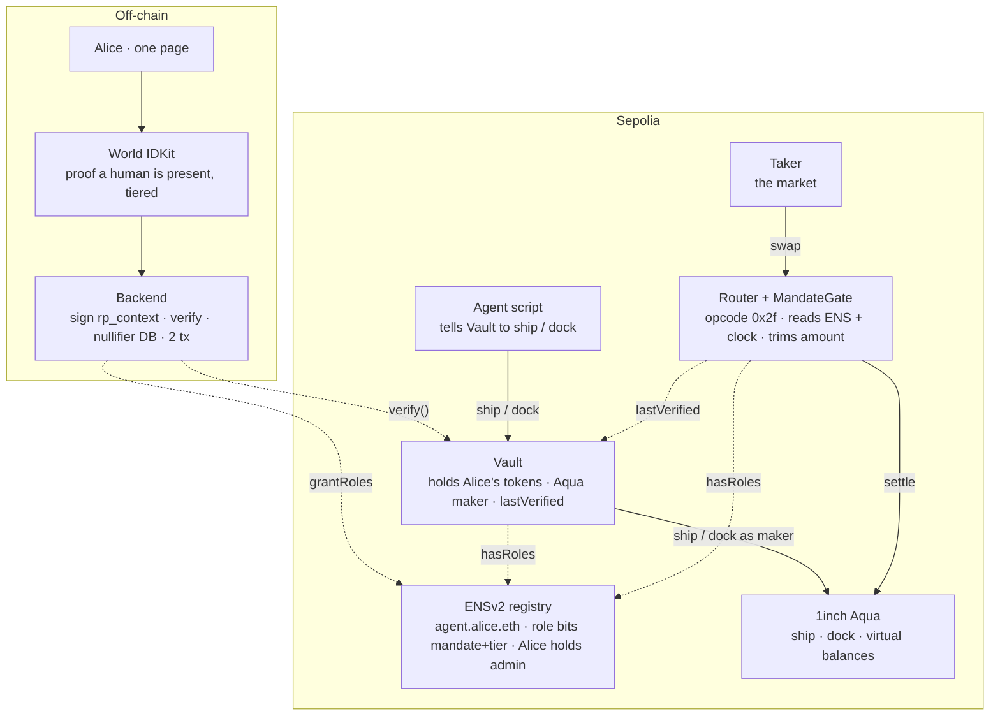

# Architecture

> Permission for an AI agent that shrinks on its own unless a verified human keeps showing up.

Solid = money or command. Dashed = permission read/write.

## Contracts

| Contract | You write? | Responsibility |
|---|---|---|
| Vault | yes | Holds tokens, is the Aqua maker. `ship()` gated by ENS role + `capNow()>0`. `dock()` open to agent/owner. `withdraw()` owner only. `verify()` backend only. |
| MandateGate (lib) | yes | Opcode `_2f`. Reads `hasRoles` and `lastVerified`, computes decayed cap, trims `amountIn/Out`. Read-only. |
| MandateAquaRouter | yes | `AquaSwapVMRouter` + `_runOpcode` override dispatching `_2f`. |
| ENSv2 PermissionedRegistry | no | Source of truth for authority. Alice's UserRegistry proxy. |
| Aqua | no | Self-deployed on Sepolia (no official testnet deploy). |

## Authority

- Alive if `hasRoles(tokenId, MANDATE|TIER, agent)` is true.
- Cap = `base >> (elapsed/24h)` minus linear interpolation inside the period. Zero after ~3 days.
- `base` from tier bit: selfie 2,000 · document 7,500 · orb 15,000.
- Any verification stamps `lastVerified` and (re)grants the tier bit.
- Expiry on the ENS name removes all roles automatically.

## Why each sponsor is load-bearing

- Without World, the agent renews its own permission and decay is theatre.
- Without ENS, nothing on-chain can read the permission at execution time.
- Without the opcode, enforcement lives in a backend, not in the VM.

## Decisions still open

- Vault as Aqua maker (Aqua uses `msg.sender`) — confirm with 1inch mentor.
- Exact `credential_type` strings from World portal — confirm in sandbox.
