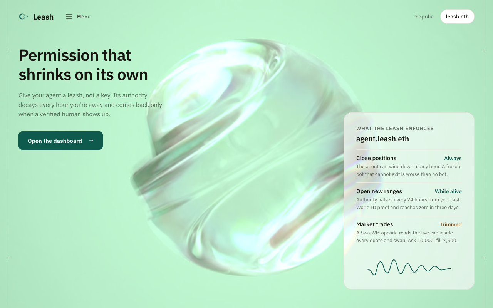
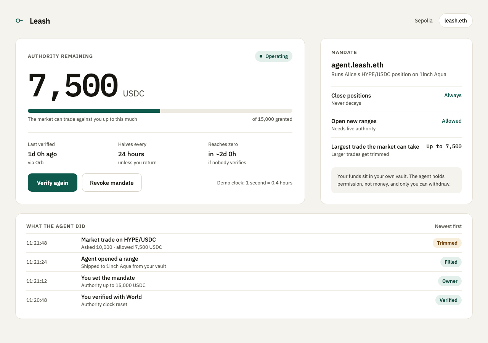
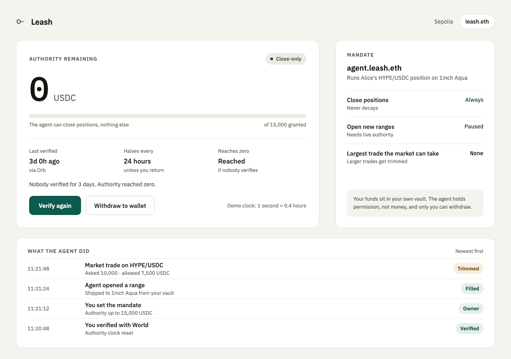

# Re:Leash

> **Leash**: permission for an AI agent that shrinks on its own unless a verified human keeps showing up. (Submitted to ETHGlobal Tokyo 2026 as *Re:Leash*; the product, the ENS names and the code say Leash.)

Built solo at **ETHGlobal Tokyo 2026** (From Scratch track). **Live: [leash.robbyn.xyz](https://leash.robbyn.xyz)** (dashboard at [/app](https://leash.robbyn.xyz/app)), contracts on Sepolia. Targets: ENSv2, World ID, 1inch Aqua.



## The problem

On 1inch Aqua a strategy is immutable: to adjust a position you `dock()` it and `ship()` a new one. So whoever keeps a position in range must hold dock/ship authority, and **whoever can dock can take the whole balance**. Every way to hand that to a bot today is all-or-nothing: an operator approval, a session key, an API key. Expiry is a cliff that strands the bot mid-position. Per-action signing makes the human the bottleneck at 3 a.m.

## What Leash does

Anyone with a wallet gives their agent a **mandate** instead of a key. Connect, create your vault (one transaction: the vault, `<name>.leash.eth` registered to you, the agent's mandate), verify with World, deposit, set a cap. Then:

- **It lives in ENS.** The agent holds a role bit on `agent.leash.eth`, in Alice's own ENSv2 registry. She can revoke it; anyone can read it on-chain.
- **It shrinks by itself.** A cap on how much the market can take from her position halves every 24 hours from the last time a human proved presence, and reaches zero after three days. Her World ID credential sets the ceiling (Selfie Check 2,000 · passport 7,500 · Orb 15,000 USDC).
- **Only a human can renew it.** A World ID proof, verified server-side, stamps the clock and (re)grants the tier. The agent cannot renew itself, so the decay is real.
- **It is enforced inside the trade.** `MandateGate` is a SwapVM instruction (opcode `0x2f`) that runs in every quote and swap: revoked → revert, empty → revert, otherwise trim the USDC leg to the live cap. Nothing sits in front of the router that a bot could bypass.
- **The agent can always close.** `dock()` never reads the mandate. A frozen bot that cannot exit is worse than no bot.

| Trimming | Close-only |
|---|---|
|  |  |

## Demo, 90 seconds

1. Alice connects her wallet and creates her vault in one transaction. She verifies with World; the cap appears by tier. She deposits and sets the mandate.
2. The agent opens a position on its own (`agent/loop.mjs`).
3. The market trades; a 10,000 USDC ask fills for 7,500 as the cap decays (feed: "Asked 10,000 · allowed 7,500").
4. The cap hits zero. The agent is refused, closes the position, waits.
5. Alice verifies again; the agent resumes. Revoke and Restore do the same by hand.

The demo Vault runs at `speed = 1440`: one Sepolia block = 4.8 hours, zero in ~3 minutes. Production is `speed = 1`.

## How it fits together

```
Alice (one page) ── World ID ──► backend ──┬─ grantRoles(tier) ──► Alice's ENSv2 UserRegistry
                                           └─ verify()          ──► Vault.lastVerified
agent/loop.mjs ── ship / dock ──► Vault (Aqua maker, holds the tokens) ──► 1inch Aqua
market (any taker) ── swap ──► MandateAquaRouter ── 0x2f MandateGate ──► Vault.mandate() ──► ENS roles
```

| Piece | Where | Ours? |
|---|---|---|
| `VaultFactory` — any wallet: Vault + `<label>.leash.eth` registered to the caller + agent mandate, one transaction | `src/VaultFactory.sol` | yes |
| `Vault` — Aqua maker; `ship` needs the role + a live cap, `dock` is always open, `withdraw` owner-only, `verify` backend-only | `src/Vault.sol` | yes |
| `MandateGate` — SwapVM opcode `0x2f`; trims the USDC leg, inverse x·y=k when USDC is the computed leg; refuses pairs without USDC | `src/MandateGate.sol` | yes |
| `MandateAquaRouter` — 1inch's Aqua router + `0x2f`; 22,509 B | `src/MandateAquaRouter.sol` | yes |
| `LeashOrder` — the strategy program `MandateGate → XYCSwap → Salt` | `src/LeashOrder.sol` | yes |
| Backend — World v4 verify, single-use nonces, one human per Vault, two transactions, chain reads pinned to one block, activity feed | `backend/` | yes |
| Dashboard — four states, live decay, an ASCII leash that sags as authority decays | `frontend/` | yes |
| Landing — the Leash mark built from 2,219 beads that tightens every 6 s, live cap badge, story sections at `/` (the earlier glass hero stays at `/a`) | `frontend/landing-b/` | yes |
| ERC-8004 badge — the agent's identity from the Sepolia Identity Registry (`0x8004A818…BD9e`), shown when you pick an agent and on the mandate card; informational, never a gate | `backend/src/identity.js` | yes |
| Agent + market + attack — autonomous loop, a random taker, and a prompt-injected agent that tries six ways to get the money and is refused six times | `agent/` | yes |
| SwapVM engine, `XYCSwap`, Aqua, ENSv2 registries, IDKit | `lib/`, npm | 1inch / ENS / World |

### Why each sponsor is load-bearing

- **ENSv2.** The permission is a role bit on a name Alice owns in her own `UserRegistry`. Token admin bits cannot be delegated in ENSv2, so the backend holds tier-admin at the registry **root**: it can set tiers but never touch MANDATE. Expiry of the name kills all roles automatically.
- **World ID.** Without it the agent renews its own permission and decay is theatre. The credential is chosen for the claim we need, presence now, so Selfie Check is the minimum sufficient assurance; stronger credentials only raise the ceiling (2,000 / 7,500 / 15,000 USDC). Trust moment, fail paths and the integration debrief: [docs/WORLD-DEBRIEF.md](docs/WORLD-DEBRIEF.md). Replay protection is the signed `rp_context` nonce (single-use), not the nullifier, because the same human must be able to come back; the nullifier binds one human to one Vault.
- **ERC-8004 (not a sponsor, one afternoon).** The agent field takes any address; if it owns an ERC-8004 agent token, the page shows "agent #10531 · Leash demo agent" with a registry link, otherwise "Not in the registry · Leash bounds it anyway". 8004 says *who* an agent is; Leash says *what it may do right now*. The demo agent is registered ([tx](https://sepolia.etherscan.io/tx/0xe6a75a33a4a41a59cc8b4406f6cca1f98ba16c65419d4592e3d90e2bfd660442)); the registration file is an on-chain data URI so nothing depends on our hosting.
- **1inch Aqua / SwapVM.** The Aqua router ships with no permission instruction at all. `MandateGate` is one, and it answers *how much* rather than yes/no. Gate cost measured against the real ENSv2 registry: **26.6k gas per swap**.

## Sepolia

| | Address |
|---|---|
| `leash.eth` → Alice's UserRegistry | `0x00C79cAd7282dad808620CeeEca662EA1a3609bd` |
| VaultFactory | `0x0B037692580536e8010f2A1501313d54269052C2` |
| Demo Vault (v3) | `0x479576d6cC84c8Db48e31726B11c2DE0d00CC2B9` |
| MandateAquaRouter | `0xa091409BA5C9c6Cae2Db2e924f6b460b44Dfb62f` |
| Aqua (self-deployed) | `0x7E13F754772777D098E4f8B22f82Dcdf3Ea55cC2` |
| Demo USDC / HYPE | `0xa44B…683F` / `0xa284…9375` |

Full list in [deployments/sepolia.json](deployments/sepolia.json). World: app `app_29bb7ef1643470c4e5535a8468422e24`, RP `rp_069e54311421c6ec`, action `leash-verify`.

## Run it

```bash
git clone --recurse-submodules https://github.com/amrrobb/leash.git && cd leash
(cd lib/swap-vm && yarn install --frozen-lockfile --production --ignore-scripts)
(cd backend && npm ci) && (cd agent && npm ci) && (cd e2e && npm ci && npx playwright install chromium)
cp .env.example .env                                   # fill it in; docs/SETUP.md explains every variable
cd backend && DEMO_OWNER_KEY=$OWNER_KEY npm start      # http://localhost:8787  (dashboard at /app)
cd agent && AGENT_KEY=$AGENT_KEY node loop.mjs         # the agent
cd agent && TAKER_KEY=$TAKER_KEY node market.mjs       # the market
```

| Tests | Command | Count |
|---|---|---|
| Contracts | `forge test --no-match-path "test/fork/*"` | 71 |
| Contracts on a Sepolia fork (real ENSv2) | `forge test --match-path "test/fork/*"` | 27 |
| Backend + dashboard logic | `cd backend && npm test` | 57 |
| End to end in a browser on an Anvil fork | `npx --prefix e2e playwright test --config e2e/playwright.config.js` | 17 |

Every guard in the contracts and backend was checked by breaking it and watching a test fail. The e2e suite stubs World at exactly two edges (the IDKit script and the portal HTTP call); everything else is real.

## Docs

- [docs/product.md](docs/product.md) — problem, use case, why
- [docs/AGENT.md](docs/AGENT.md) — the agent: who decides what, the loop, why the problem is real
- [docs/INTEGRATION.md](docs/INTEGRATION.md) — the seams between ENS, World and Aqua, and every change from the pre-event plan
- [docs/SETUP.md](docs/SETUP.md) — environment, deploy, World portal, run, test
- [docs/UI-SPEC.md](docs/UI-SPEC.md) — every screen, copy, data and hooks
- [docs/MARKET.md](docs/MARKET.md) — the landscape (ERC-7715, Coinbase agent wallets, Safe modules, session keys) and what Leash does that they don't
- [NOTES.md](NOTES.md) — the integration log: every friction with dates, for the sponsor debriefs
- [ROADMAP.md](ROADMAP.md) — what was built in what order

## Known limits

- One curve. The gate's inverse math is for x·y=k; concentrated or pegged curves would need their own.
- Demo tokens. HYPE/USDC on Sepolia are mintable placeholders.
- Selfie Check is Beta and not a uniqueness guarantee; Leash uses it as a presence check with the lowest tier.
- World's simulator completes only Proof-of-Human requests; phones without native World ID 4.0 use legacy proofs (`WORLD_ALLOW_LEGACY=1`).

## Attribution

- Powered by SwapVM — © Degensoft Ltd 2025
- Built on 1inch Aqua, ENSv2 (`ensdomains/contracts-v2`) and World ID (IDKit v4).
- AI tools: Claude Code wrote code under the builder's direction. The prompts and specs it worked from are in `HANDOFF.md`, `CLAUDE.md`, `ROADMAP.md` and `docs/`.
